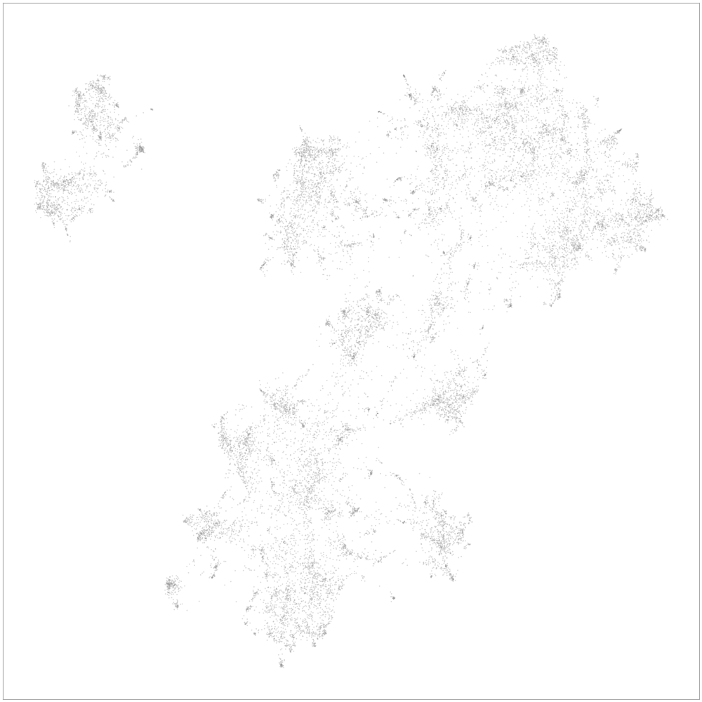
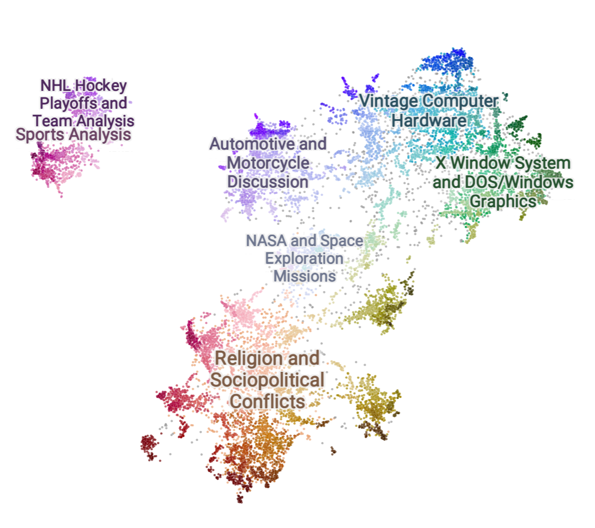

===========
Toponymy
===========

.. image:: doc/toponymy_text_horizontal.png
  :width: 600
  :align: center
  :alt: Toponymy

.. raw:: html

    <!-- Hero block -->
    

    <!-- Primary CTA -->
    

      
    

    

The package name Toponymy is derived from the Greek topos ‘place’ + onuma ‘name’.  Thus, the naming of places.  
The goal of Toponymy is to put names to places in the space of information. This could be a corpus of documents,
in which case Toponymy can be viewed as a topic naming library.  It could also be a collection of images, in which case
Toponymy could be used to name the themes of the images.  The goal is to provide a names that can allow a user to
navigate through the space of information in a meaningful way.

Toponymy is designed to scale to very large corpora and collections, providing meaningful names on multiple scales,
from broad themes to fine-grained topics.  We make use a custom clustering methods, information extraction, 
and large language models to power this. The library is designed to be flexible and easy to use.

As of now this is an beta version of the library. Things can and will break right now.
We welcome feedback, use cases and feature suggestions.

------------------
Basic Installation
------------------

You can install Toponymy using:

.. code-block:: bash

    pip install toponymy

To install the latest version of Toponymy from source you can do so by cloning the repository and running:

.. code-block:: bash

    git clone https://github.com/TutteInstitute/toponymy
    cd toponymy
    pip install .

-----------
Basic Usage
-----------

As an example, we can use Toponymy to cluster documents in the `20-Newsgroups dataset <http://qwone.com/~jason/20Newsgroups/>`_ on hugging face and then assign topic names to these clusters. The 20 newsgroups dataset contains 18,170 documents distributed roughly evenly across 20 different newsgroups. You can compute vector representations of each document on your own (see `Vector Construction <https://github.com/TutteInstitute/toponymy?tab=readme-ov-file#vector-construction>`_ for instructions), but this can be very expensive without a GPU. We recommend downloading our precomputed vectors. Code to retrieve these vectors is below:

.. code-block:: python

    import numpy as np
    import pandas as pd
    newsgroups_df = pd.read_parquet("hf://datasets/lmcinnes/20newsgroups_embedded/data/train-00000-of-00001.parquet")
    text = newsgroups_df["post"].str.strip().values
    document_vectors = np.stack(newsgroups_df["embedding"].values)
    document_map = np.stack(newsgroups_df["map"].values)

After running the above code, ``document_vectors`` will contain 768-dimensional embeddings for each of the 18,170 documents in the dataset and ``document_map`` will contain 2-dimensional embeddings of these same documents.

We can visualize the documents using the 2-dimensional representations in ``document_map``:

.. code-block:: python

  import datamapplot
  plot = datamapplot.create_plot(document_map)
  display(plot)

Once we have a low-dimensional representation, we can do the topic naming. 
Toponymy will make use of a clusterer to create a balanced hierarchical layered 
clustering of our documents. (In this case, we use ``ToponymyClusterer`` on the 2-dimensional vectors in ``document_map``.)

.. code-block:: python

    from toponymy import ToponymyClusterer
    clusterer = ToponymyClusterer(min_clusters=4, verbose=True)
    clusterer.fit(clusterable_vectors=document_map, embedding_vectors=document_vectors)
    for i, layer in enumerate(clusterer.cluster_layers_):
        print(f'{len(np.unique(layer.cluster_labels))-1} clusters in layer {i}')

Toponymy will then use a variety of sampling and summarization techniques to construct prompts 
describing each cluster to pass to a large language model (LLM).  

Note that Toponymy also requires an embedding model for determining which of the documents will be most relevant to each
of our clusters.  This doesn't have to be the embedding model that our documents were embedded with but it 
should be similar.

.. code-block:: python

    from sentence_transformers import SentenceTransformer
    embedding_model = SentenceTransformer("all-MiniLM-L6-v2")

Toponymy supports multiple LLMs, including Cohere, OpenAI, and Anthropic via service calls, and local models via
Huggingface and LlamaCpp. Here we show an example using OpenAI. 

You will need to get a free `OpenAI key <https://platform.openai.com/api-keys>`_ and store it in the file ``openai_key.txt`` before running this code.
Also make sure that openai is installed in your environment. You can test your connection to OpenAI with the test_llm_connectivity() method before running Toponymy.

.. code-block:: python

    import openai
    from toponymy import Toponymy
    from toponymy.llm_wrappers import OpenAINamer
    
    openai_api_key = open("openai_key.txt").read().strip()
    llm = OpenAINamer(openai_api_key)
    llm.test_llm_connectivity()

The following code will generate a topic naming
for the documents in the data set using the ``document_vectors``, ``document_map``, and ``embedding_model`` created above.
(Warning are filtered here because they can interfere with the display of the progress bar.)

.. code-block:: python

    import warnings
    warnings.filterwarnings('ignore')

    topic_model = Toponymy(
        llm_wrapper=llm,
        text_embedding_model=embedding_model,
        clusterer=clusterer,
        object_description="newsgroup posts",
        corpus_description="20-newsgroups dataset",
        exemplar_delimiters=["<EXAMPLE_POST>\n","\n</EXAMPLE_POST>\n\n"]
    )
    
    # Note on data types for fit() method:
    # - text: Python list of strings (not numpy array)
    # - document_vectors: numpy array of shape (n_documents, embedding_dimension)
    # - document_map: numpy array of shape (n_documents, clustering_dimension)
    topic_model.fit(text, document_vectors, document_map)

``topic_model`` will contain ``topic_names``, a list of lists which can be used to explore the unique topic names in each layer or resolution.
Let's examine the last layer of topics. There were five clusters in this layer. Toponymy assigns a name to each cluster.

.. code-block:: python

    topic_names = topic_model.topic_names_

    topic_names[-1:]

    [['Sports Analysis',
    'Religion and Sociopolitical Conflicts',
    'Automotive and Motorcycle Discussion',
    'X Window System and DOS/Windows Graphics',
    'Vintage Computer Hardware']]

Our gray 2-D plot from above can now be displayed with labeled clusters. (See `Interactive Topic Visualization <https://github.com/TutteInstitute/toponymy?tab=readme-ov-file#interactive-topic-visualization>`_ for more details on generating interactive plots.)

At this particular level of resolution, this plot also shows one topic ('NASA and Space Exploration Missions') from the second to last layer of clusters. 

.. code-block:: python

    topic_names[-2:]

    [['NHL Hockey Playoffs and Team Analysis',
    'Major League Baseball Analysis',
    'NASA and Space Exploration Missions',
    'Clipper Chip Encryption and Privacy Debate',
    'Medical Discussions on Chronic Diseases and Diet',
    'Middle East Conflicts and Israeli-Palestinian Issues',
    'Automotive and Motorcycle Discussion',
    'Christianity, Faith, and Religious Debates',
    'Waco Siege and Government Controversy',
    'US Gun Rights and Regulation Debate',
    'Political and Social Controversies Online',
    'X Window System and DOS/Windows Graphics',
    'Vintage PC and Macintosh Hardware',
    'PC Hard Drive Interfaces and Troubleshooting'],
    ['Sports Analysis',
    'Religion and Sociopolitical Conflicts',
    'Automotive and Motorcycle Discussion',
    'X Window System and DOS/Windows Graphics',
    'Vintage Computer Hardware']]

``topics_per_document`` contains topic labels for each document, with one list for each level of resultion in our 
cluster layers.  In our above case this will be a list of 5 layers each containing a list of topic labels for each of the 18,170 documents.  
Documents that aren't contained within a cluster at a given layer are given the topic ``Unlabelled``.

.. code-block:: python
    
    topics_per_document = [cluster_layer.topic_name_vector for cluster_layer in topic_model.cluster_layers_]
    topics_per_document
    

    [array(['Unlabelled',
            'Discussion on VESA Local Bus Video Cards and Performance',
            'Unlabelled', ...,
            'Cooling Solutions and Components for CPUs and Power Supplies',
            'Algorithms for Finding Sphere from Four Points in 3D',
            'Automotive Discussions on Performance Cars and Specifications'], dtype=object),
    array(['NHL Playoff Analysis and Predictions',
            'Graphics Card Performance and Benchmark Discussions',
            'Armenian Genocide and Turkish Atrocities Discourse', ...,
            'Cooling Solutions and Components for CPUs and Power Supplies',
            'Algorithms for 3D Polygon Processing and Geometry',
            'Discussions on SUVs and Performance Cars'], dtype=object),
    array(['NHL Playoff Analysis and Predictions',
            'Video Card Drivers and Performance',
            'Armenian Genocide and Turkish Atrocities', ..., 'Unlabelled',
            'Unlabelled', 'Automotive Performance and Used Cars'], dtype=object),
    array(['NHL Playoffs and Player Analysis',
            'Vintage Computer Hardware and Upgrades', 'Unlabelled', ...,
            'Unlabelled', 'X Window System and Graphics Software',
            'Automotive Performance and Safety'], dtype=object),
    array(['Sports Analysis', 'Computer Hardware', 'Unlabelled', ...,
            'Unlabelled', 'X Window System and Graphics Software',
            'Automotive Performance and Safety'], dtype=object)]

-----------------------------------
Interactive Topic Visualization
-----------------------------------

Once you’ve generated the topic names and document map, it's helpful to visualize how topics are distributed across your corpus. We recommend using the `DataMapPlot <https://github.com/TutteInstitute/datamapplot>`_ library for this purpose. It creates interactive, zoomable maps that allow you to explore clusters and topic labels in a spatial layout. It is particularly well suited to exploring data maps along with layers of topic names. 

Here is an example of using ``datamapplot`` to visualize your data. We can pass in our ``document_map``, ``document_vectors`` and newly created ``topics_per_document`` as input:

.. code-block:: shell

    pip install datamapplot
    conda install -c conda-forge datamapplot

.. code-block:: python

    import datamapplot
    topic_name_vectors = [cluster_layer.topic_name_vector for cluster_layer in topic_model.cluster_layers_]

    plot = datamapplot.create_interactive_plot(
        document_map,
        *topic_name_vectors,
    )

    plot

This will launch an interactive map in your browser or notebook environment, showing document clusters and their associated topic names across all hierarchical layers. You can zoom in to explore fine-grained topics and zoom out to see broader themes, enabling intuitive navigation of the information space.

-----------------------------------
Controlling Verbose Output
-----------------------------------

Toponymy provides a unified ``verbose`` parameter to control progress bars and informative messages across all components:

.. code-block:: python

    # Show all progress bars and messages
    clusterer = ToponymyClusterer(min_clusters=4, verbose=True)
    
    # Suppress all output for silent operation
    clusterer = ToponymyClusterer(min_clusters=4, verbose=False)
    
    # The same parameter works for all components
    topic_model = Toponymy(
        llm_wrapper=llm,
        text_embedding_model=embedding_model,
        verbose=True  # Shows progress for all operations
    )

The ``verbose`` parameter unifies the older separate ``verbose`` and ``show_progress_bar`` parameters, providing a simpler and more consistent interface. Legacy parameters are still supported for backward compatibility but will show deprecation warnings.

-------------------
Vector Construction
-------------------

If you do not have ready made document vectors and low dimensional representations of your data you will need to compute 
your own. For faster encoding change device to: "cuda", "mps", "npu" or "cpu" depending on hardware availability. Alternatively,
one could make use of an API call to embedding service.  Embedding wrappers can be found in:

.. code-block:: python

    from toponymy.embedding_wrappers import OpenAIEmbedder

or the embedding wrapper of your choice. Once we generate document vectors we will need to construct a low dimensional representation.  
Here we do that via our UMAP library.  

.. code-block:: python

    pip install umap-learn
    pip install pandas
    pip install sentence_transformers

    import pandas as pd
    from sentence_transformers import SentenceTransformer
    import umap

    newsgroups_df = pd.read_parquet("hf://datasets/lmcinnes/20newsgroups_embedded/data/train-00000-of-00001.parquet")
    text = newsgroups_df["post"].str.strip().values
    embedding_model = SentenceTransformer("all-MiniLM-L6-v2", device="cpu")

    document_vectors = embedding_model.encode(text, show_progress_bar=True)
    document_map = umap.UMAP(metric='cosine').fit_transform(document_vectors)

-------
License
-------

Toponymy is MIT licensed. See the LICENSE file for details.

------------
Contributing
------------

Contributions are more than welcome! If you have ideas for features of projects please get in touch. Everything from
code to notebooks to examples and documentation are all *equally valuable* so please don't feel you can't contribute.
To contribute please `fork the project <https://github.com/TutteInstitute/toponymy/fork>`_ make your
changes and submit a pull request. We will do our best to work through any issues with you and get your code merged in.
