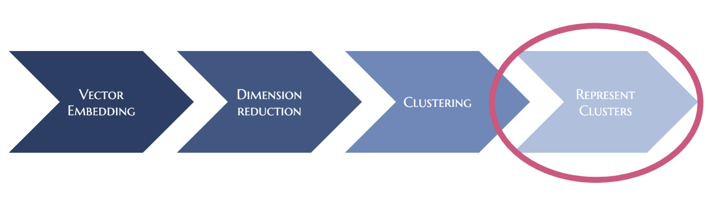

===========
TopicNaming
===========

TopicNaming is a simple class for smoothing out the process of abstractive cluster description for vector based 
topic modeling techniques such as top2vec or BERTopic.  This is the problem often described as topic representation.

Techniques such as top2vec or BERTopic work via embedding our documents (or other objects) 
into a semantic space via some technique such as a Sentence Transformer.  This gives a user a vector representation
of their documents. They then use dimension reduction and rebust clustering technique to find dense clusters of documents
discussing a single concept.  It is useful to leverage clustering techniques that are robust robust to noise 
(such as `hdbscan <https://github.com/scikit-learn-contrib/hdbscan>`_) to identify these topical clusters.  This 
typically allows for more filtering of background documents that don't have a sufficiently large number of similar documents
within your corpus to be considered a topic.  This style of topic modeling works well for short to medium length homogeneous 
documents that are about a single topic
but requires extra work such as document segmentation to be effective on longer or heterogeneous documents.

Finally a representation must be chosen for each cluster or topic, which is the focus of this library.  The Techniques
used in this library are broadly similar to the prompt engineering methods described in 
`BERTopic 6B LLM & Generative AI <https://maartengr.github.io/BERTopic/getting_started/representation/llm.html>`_.  

The primary differences are:

* the layered approach we use for clustering our documents into topics tailored towards hierarchical topic modeling.
* the cluster sampling strategies that we employ (see `EVōC <https://github.com/TutteInstitute/evoc/>`_ for more details)
* the prompt engineering used for naming our topics
* and a final step for dealing with duplicate topics within our hierarchy 

As of now this is very much an early beta version of the library. Things can and will break right now.
We would welcome feedback, use cases and feature suggestions however.

------------------
Basic Installation
------------------

For now install the latest version of TopicNaming from source you can do so by cloning the repository and running:

.. code-block:: bash

    git clone https://github.com/TutteInstitute/topicnaming
    cd topicnaming
    pip install .

We will use the LLM inference framework `llama.cpp <https://github.com/abetlen/llama-cpp-python>`_ for running our large language models that will name our topics.  
This means we will need to download our own models.  Since this library is built on top of C++ it is best installed via command
line with various parameters to help optimize it for your system.  Detailed instructions for installing this library can 
be found `here <https://github.com/abetlen/llama-cpp-python?tab=readme-ov-file#installation-configuration>`_.

Leveraging a GPU can significantly speed up the process of topic naming and is highly recommended.  If you don't have access 
to a GPU install llama.cpp as follows:
If you have:

**Linux and Mac no GPU**

.. code-block::bash

    CMAKE_ARGS="-DLLAMA_BLAS=ON -DLLAMA_BLAS_VENDOR=OpenBLAS" pip install llama-cpp-python

**Linux and Mac with GPU**

.. code-block::bash

    CMAKE_ARGS="-DLLAMA_CUDA=on" pip install llama-cpp-python

We will also need a large language model downloaded.  In our experiments we find that the 
`mistral-7B <https://arxiv.org/abs/2310.06825>`_ model gives solid results.

.. code-block::bash

    wget https://huggingface.co/TheBloke/OpenHermes-2.5-Mistral-7B-GGUF/resolve/main/openhermes-2.5-mistral-7b.Q4_K_M.gguf
    
We will use sentence_transformers for embedding out documents (and eventually keywords) into a consistent space.  
Sentence_transformers is a a requirement of this package and thus should be installed by default.  Sentence_transformers 
is also capable of downloading it's own models.  

-----------
Basic Usage
-----------

We will need our documents, document vectors and a low dimensional representation of these document vector to construct
our represenation.  This can be very expensive without a GPU so we recommend storing and reloading these vectors as 
needed.  For faster encodeing change device to: "cuda", "mps", "npu" or "cpu" depending on hardware availability.  Once we 
generate document vectors we will need to construct a low dimensional representation.  Here we do that via our UMAP library.

.. code-block::python

    data = pd.read_csv('doc/ai_papers.zip')
    text =data.title+" "+data.abstract
    embedding_model = sentence_transformers.SentenceTransformer("all-mpnet-base-v2", device="cpu") 
    document_vectors = embedding_model.encode(text, show_progress_bar=True)
    document_map = umap.UMAP(metric='cosine').fit_transform(document_vectors)

Once these 

.. code-block::python

    from topicnaming import TopicNaming

    llm = Llama(model_path=str("openhermes-2.5-mistral-7b.Q4_K_M.gguf"), n_gpu_layers=0, n_ctx=4096, stop=["--", "\n"], verbose=False, n_threads=48)
    embedding_model = sentence_transformers.SentenceTransformer("all-mpnet-base-v2", device="cpu")
    data = pd.read_csv('examples/ai_arxiv_papers.zip')
    data_map = np.load('examples/ai_arxiv_coordinates.npz.npy')
    data_vectors = np.load('examples/ai_arxiv_vectors.npy')

    topic_namer = TopicNaming(documents=data.title,
                          document_vectors=data_vectors, 
                          document_map=data_map, 
                          embedding_model=embedding_model,  
                          llm = llm,
                          document_type='titles',
                          corpus_description='artificial intelligence articles',
                          verbose=True,
                         )
    topic_namer.clean_topic_names()

-------
License
-------

TopicNaming is MIT licensed. See the LICENSE file for details.

------------
Contributing
------------

Contributions are more than welcome! If you have ideas for features of projects please get in touch. Everything from
code to notebooks to examples and documentation are all *equally valuable* so please don't feel you can't contribute.
To contribute please `fork the project <https://github.com/TutteInstitute/topicnaming/issues#fork-destination-box>`_ make your
changes and submit a pull request. We will do our best to work through any issues with you and get your code merged in.
