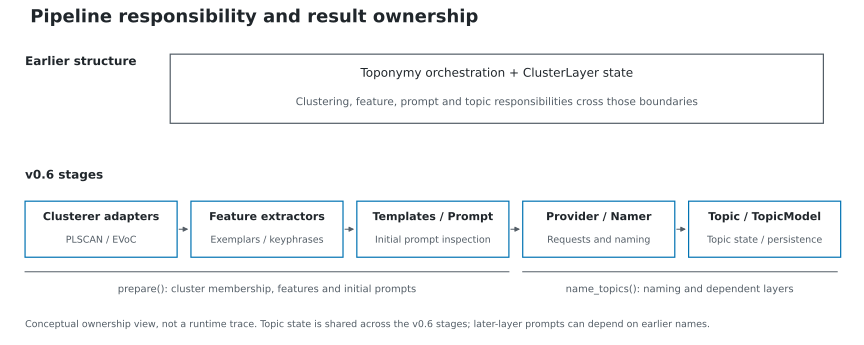
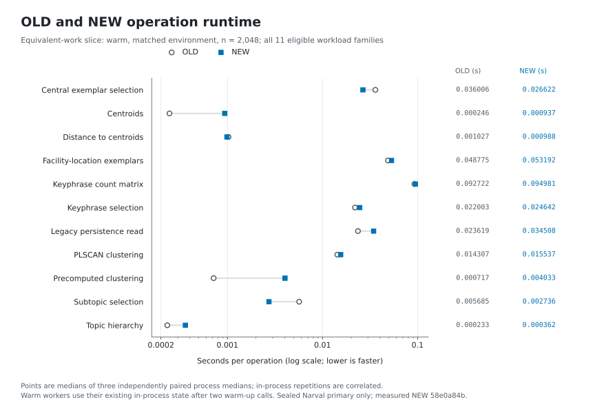
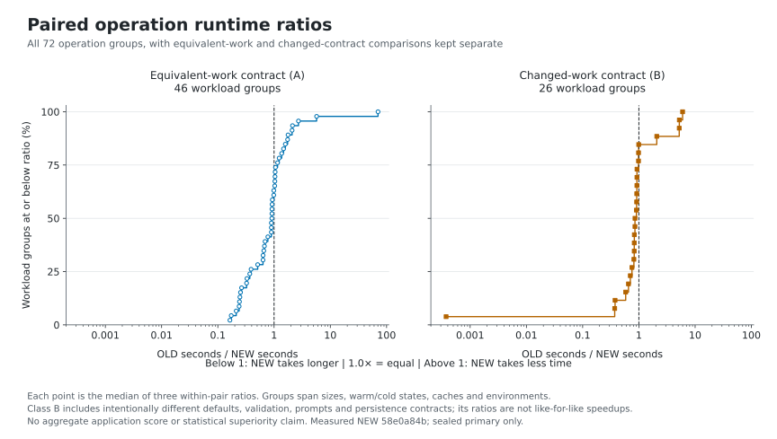
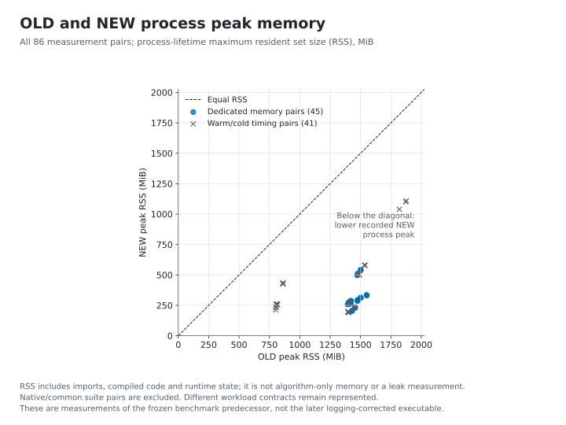
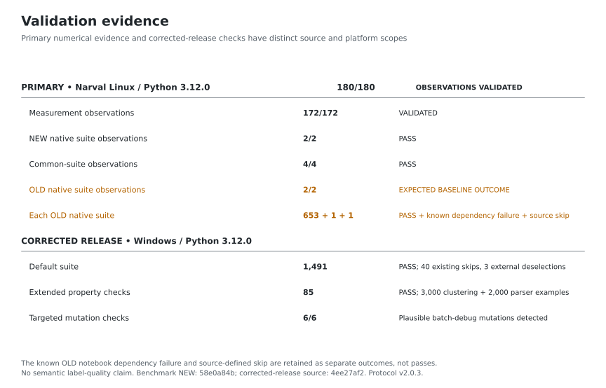

Refactor benchmark and validation
=================================

Performance is workload-dependent. This comparison includes improvements and
regressions, and separates equivalent-work operations from deliberately changed
pipeline, prompt, validation and persistence contracts. It does not measure
semantic label quality.

Architecture context
--------------------

This is an ownership overview, not a performance result. See :doc:`migration`
for API changes and :doc:`basic_usage` for preparing features and prompts before
requesting names.

Measured versions and environment
----------------------------------

The frozen numerical comparison used:

* OLD: ``ca9cfedab141338fac57a8a0de1c4d947d8e9330``.
* NEW: ``58e0a84b6863e7307a90c78597130679dc185787``.
* Narval, Digital Research Alliance of Canada; AMD Rome CPUs, Linux,
  Python 3.12.0; one allocated CPU per sequential OLD/NEW pair.

The later release correction changes managed Cohere/Azure batch debug payloads
to JSON-compatible records. Those callbacks are outside the measured numerical
operations. The numerical implementation is unchanged, but these timings and
memory measurements belong to the frozen NEW version above. They do not measure
the corrected executable's import time, whole-worker time or RSS.

There are 90 ordered pairs and 180 observations. Each pair runs on the same
node/CPU allocation, with its specified arm order, inputs and seeds. Up to 64
pairs can run concurrently. Shared-node interference is recorded, not eliminated.
Matched environments use the controlled comparison dependency configuration;
native environments reproduce each version's own environment contract. They are
labelled separately rather than pooled as one dependency comparison.

Warm operation workers execute two untimed warm-ups, then repeated operations in
the same process. Cold workers execute the operation once in a fresh process.
An empty cache and a cache populated by a separate priming process are distinct
conditions. Import, setup/staging, operation, whole-worker and queue time are
different measurements; the runtime plots below show operation time only.

All plotted performance data come from independently audited, sealed primary
observations under Protocol v2.0.3. Pilot, diagnostic, reference-generation and
stress-run timings are excluded. Six observations were measured in a replacement
wave after independent cache-conditioned reference establishment; the other 174
were retained by immutable evidence identity. Timing-wave and shared-node effects
limit comparisons. No overall campaign-throughput claim is made.

Operation runtime
-----------------

This uniform slice includes every equivalent-work family measured with warm
workers in the matched environment at ``n=2048``. Points are medians of three
process medians. Repetitions within a process are correlated, not independent
trials. There are too few independent repetitions to claim broad statistical
superiority.

.. list-table:: Two contrasting examples from the same slice
   :header-rows: 1
   :widths: 40 30 30

   * - Operation
     - OLD median (seconds)
     - NEW median (seconds)
   * - Central exemplar selection
     - 0.0360059555
     - 0.0266224680
   * - Precomputed clustering
     - 0.0007166735
     - 0.0040329590

Central selection takes less operation time here. Precomputed clustering takes
more; its small absolute duration should be retained when interpreting the
relative change. Neither result is an overall application score.

Runtime ratios
--------------

Each point represents one workload group, defined by operation, size, process
mode, environment and cache condition. Its value is the median of three
within-pair OLD/NEW ratios. This estimator can differ from dividing the separate
OLD and NEW medians in the first figure. All 72 groups are shown; no extremes are
trimmed. Groups sharing a process are correlated.

Class A uses the benchmark's equivalent-work contracts. Class B intentionally
includes changed defaults or changed validation, prompt and persistence work.
Class B ratios describe those executions and are not like-for-like speedups.
Counting faster and slower groups would be descriptive, not a weighted measure
of application performance.

Process memory
--------------

The scatter includes all 86 measurement pairs: 45 dedicated memory pairs and
41 warm/cold timing pairs. RSS is the measured process's lifetime maximum,
including imports, compiled code and runtime state. It is not algorithm-only
memory, a process-tree total or evidence of long-running leak freedom. Native and
common test-suite executions are excluded. Workload contracts still differ in
the cases classified as B.

Validation outcomes
-------------------

**180/180 observations validated does not mean 180/180 passed.** The two OLD
native executions each produced 653 strict passes, one known dependency failure
and one source-defined skip. No exception was relabelled as a pass:

* ``test_doc_notebook_no_openainamer[notebook0]`` in ``clusterers.ipynb`` retains
  the OLD EVoC/fast-hdbscan/Numba in-process namedtuple dispatch collision as a
  known dependency limitation.
* ``test_evoc_clusterer_class`` retains the unchanged source marker that skips
  EVoC with fast-hdbscan 0.3 or newer; the frozen version is 0.3.2.

The two NEW native observations and four common-suite observations satisfy their
strict frozen suite criteria. Independent auditing verifies the complete
identity/outcome sets, output references, environment/resource records and
artifact hashes.

The separate corrected-release checks use source
``4ee27af26a0528b5562f0023dd7f4a809ef7a1a7`` on Windows/Python 3.12.0: 1,491
default-test passes, 40 existing skips and 3 existing external deselections;
85 extended property checks covering 3,000 clustering and 2,000 parser examples;
and six detected targeted batch-debug mutations with a passing control.
The skips concern historical external notebooks and opt-in local-model tests.
These checks do not certify every operating system, Python version or live
provider. The mutation result applies to the targeted debug behavior, not the
entire project.

Cache and floating-point reproducibility
----------------------------------------

Both OLD and NEW exhibit a dependency/runtime sensitivity in supervised
information weighting. Freshly compiled and cache-loaded code can use different
floating-point reduction semantics. Initially tiny differences can change
keyphrase ranking, selected membership and prompt text. Those changed outputs
are material: cache invariance and semantic equivalence are not claimed.

The earlier v2.0.2 protocol exposed this limitation by assuming one output
reference across the affected cache conditions. It remains unaccepted for those
observations. Protocol v2.0.3 uses independently established, separately frozen
references for the affected populated-cache executions, with two fresh
reproductions per affected identity on different Narval nodes. Priming still
requires the original empty-cache reference. OLD and NEW use the same policy;
no tolerance, source, dependency or seed was changed to hide the behavior.

Human judgement of topic names and a comparable common embedding/cluster output
are outside this evidence. **Semantic label quality: NOT_VALIDATED.** No cluster
visualization or quality-superiority claim follows from these runtime figures.

Evidence identity
-----------------

The published figures were checked against these SHA256 seals before generation:

* Primary: ``b2b338e4e2b06b937c566c6aa2d55f2a2f865146ed510b1921e7b73116d5f434``.
* Dossier: ``6ad796e4485d3a36f4eb91e2e3657a232ac0ea0701d50f1a743bf6b819ec6fe9``.
* Protocol v2.0.3: ``18b93ebc721d4854819f60765cdc666b61fa7721e1a9ed83542eeb57b8b22e64``.

The figure sources are the sealed primary, pair and operation result tables,
checked against the accepted observations. Only the presentation and this
interpretation are included here; raw execution and orchestration records are
kept outside the project source tree.
